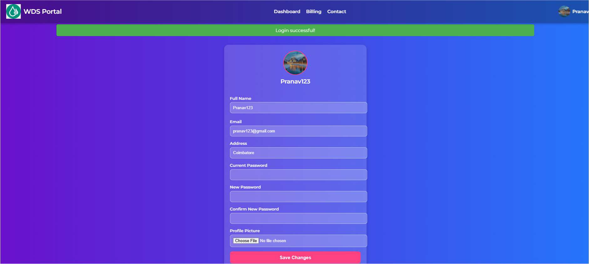
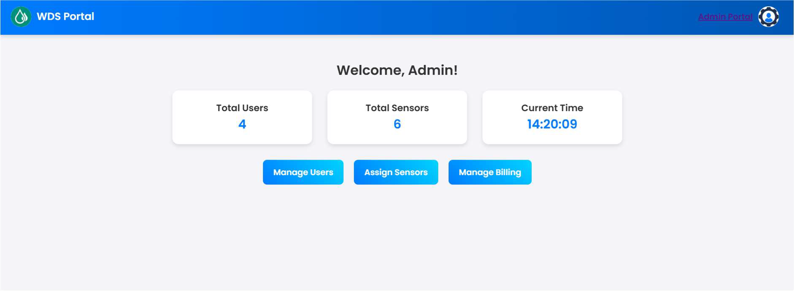
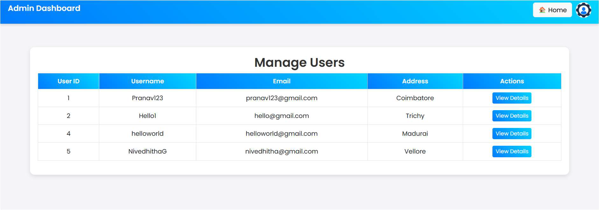
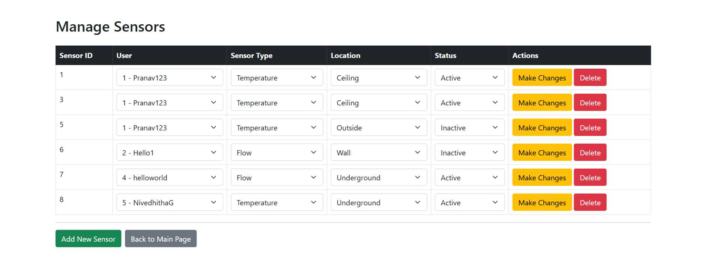
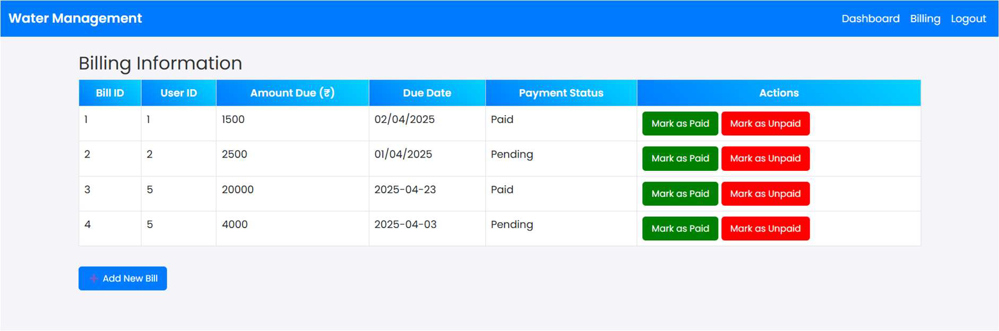

## 👥 Contributors:
- **Pranav Karthikeyan** - `CB.EN.U4ELC22062`  
- **Nivedhitha G** - `CB.EN.U4ELC22036`

---

## 📌 Abstract:

Water wastage and inefficiencies in distribution remain critical challenges, leading to resource depletion, high operational costs, and energy inefficiency.

This project proposes an **IoT-enabled Smart Water Distribution System** that integrates real-time monitoring, database management, and adaptive control to:

- Optimize water usage 💧  
- Detect leakages 🚨  
- Enhance sustainability 🌱  

The system employs **IoT sensors** to continuously track water flow, pressure, consumption, and leakage.  
Data is processed using a **Python + MySQL** backend for efficient storage, analysis, and anomaly detection.

A **user-friendly dashboard** provides:

- Real-time insights 📊  
- Automated alerts 🔔  
- Remote-control functionalities 🌐  

**Predictive analytics** enhance demand forecasting, enabling smart water allocation and energy-efficient distribution.

### 🔑 Key Features:
- ✅ **Real-time Monitoring & Alerts** – Detects anomalies like leakages and excessive usage  
- ✅ **Adaptive Water Distribution** – Dynamically adjusts supply based on demand patterns  
- ✅ **Energy Efficiency & Cost Reduction** – Optimizes resource allocation to minimize losses  
- ✅ **Data Analytics & Predictive Maintenance** – Prevents failures and improves long-term planning  

This scalable and intelligent solution empowers stakeholders—**municipalities, industries, and residential users**—to ensure a **sustainable, efficient, and resilient water management system**. By integrating automation, AI-driven analytics, and IoT-based monitoring, the system revolutionizes modern water distribution networks.

---

## 🗂️ ER Diagram:

## Login Page:

## User Dashboard:

## User Settings:

## Admin Panel:

## Manage Users Database - From Admin side:

## Manage Sensors - From Admin Side:

## Billing Management:

